# AI-Native IDE — Architecture Notes

> _Technical mapping of the existing Roo Code extension architecture, privilege separation model, sidecar data model specification, and identification of governance hook insertion points._

**Version**: 2.0.0 | **Authored**: 2026-02-17 | **Updated**: 2026-02-21

---

## Table of Contents

0. [Foundation](#0-foundation)
1. [Current Extension Architecture Overview](#1-current-extension-architecture-overview)
2. [Tool Execution Loop Mapping](#2-tool-execution-loop-mapping)
3. [LLM Request/Response Lifecycle](#3-llm-requestresponse-lifecycle)
4. [System Prompt Construction Pipeline](#4-system-prompt-construction-pipeline)
5. [Identified Interception Points](#5-identified-interception-points)
6. [Privilege Separation & Hook Middleware Boundary](#6-privilege-separation--hook-middleware-boundary)
7. [Sidecar Data Model (.orchestration/)](#7-sidecar-data-model-orchestration)
8. [Three-State Execution Flow](#8-three-state-execution-flow)
9. [Concurrency & Safety Injection Points](#9-concurrency--safety-injection-points)
10. [Visual System Blueprints](#10-visual-system-blueprints)
11. [Appendix A: File Reference Map](#appendix-a-file-reference-map)
12. [Appendix B: Modification Impact Summary](#appendix-b-modification-impact-summary)

---

## 0. Foundation

### Roo Code Extension for Visual Studio Code

Roo Code is an open-source, AI-powered coding assistant built as a VSCode extension. It integrates large language models directly into the editor, effectively acting like an AI-powered development team inside the IDE. Developers issue plain-English requests through a sidebar panel to generate code, refactor files, run tests, and more. Roo Code is model-agnostic — it works with Anthropic Claude, OpenAI GPT, Google Gemini, and local Ollama-based models.

**Key capabilities:** multi-file editing, automated debugging, context-aware Q&A, MCP tool integration, multiple specialized modes (Code, Ask, Architect, Debug, Custom).

**Privacy:** Roo Code runs as a local VSCode extension. Code stays on the machine unless explicitly sent to a cloud model. All proposed file changes and command executions require user approval before execution.

### Governance Hierarchy

The extension's operations are governed by a hierarchy of documents:

- **Architecture Notes** (This document): The technical blueprint mapping governance onto the physical codebase.
- **active_intents.yaml**: The source of truth for what work is authorized and which agent owns which scope.
- **agent_trace.jsonl**: The immutable audit ledger linking every code mutation back to a declared intent.

---

## 1. Current Extension Architecture Overview

### 1.1 High-Level Component Map (With Privilege Separation)

The extension follows a VS Code Webview Extension architecture with **four distinct privilege domains**. The Hook Engine acts as a strict middleware boundary between the Extension Host's core logic and all mutating operations:


### 1.2 Webview (UI Layer) Responsibilities

**Location:** `webview-ui/src/`

The Webview is a React application rendered inside a VS Code Webview Panel. It is a **pure presentation layer** with no direct access to the filesystem, Node.js APIs, or extension state.

- Renders the chat interface (user messages, assistant responses, tool use visualizations)
- Presents tool approval dialogs (ask/approve/deny workflow)
- All communication is serialized JSON over the VS Code message bridge
- The Webview **CANNOT** invoke tools, access files, or call LLM APIs directly

### 1.3 Extension Host Responsibilities

**Location:** `src/`

| Component                 | Location                            | Responsibility                                                                                       |
| ------------------------- | ----------------------------------- | ---------------------------------------------------------------------------------------------------- |
| `extension.ts`            | `src/extension.ts`                  | Entry point. Activates extension, registers commands, creates ClineProvider                          |
| `ClineProvider`           | `src/core/webview/ClineProvider.ts` | Webview host. Manages Task lifecycle, routes webview messages                                        |
| `Task`                    | `src/core/task/Task.ts`             | **Core execution engine.** Manages the LLM conversation loop, tool dispatch, message history         |
| `ApiHandler`              | `src/api/index.ts`                  | Abstraction over LLM providers. `buildApiHandler()` factory creates provider-specific handlers       |
| `BaseTool`                | `src/core/tools/BaseTool.ts`        | Abstract base for all tools. Defines `execute()`, `handlePartial()`, `handle()` lifecycle            |
| `presentAssistantMessage` | `src/core/assistant-message/`       | **The single choke point.** Processes streamed assistant content blocks, dispatches tool invocations |
| `system.ts`               | `src/core/prompts/system.ts`        | Constructs the system prompt from modular sections                                                   |
| `build-tools.ts`          | `src/core/task/build-tools.ts`      | Builds the tools array for LLM requests, filtered by mode                                            |
| `validateToolUse`         | `src/core/tools/validateToolUse.ts` | Validates tool names and mode-based permissions at execution time                                    |

### 1.4 Package Architecture

| Package                 | Location                | Role                                                      |
| ----------------------- | ----------------------- | --------------------------------------------------------- |
| `@roo-code/types`       | `packages/types/`       | Shared TypeScript type definitions (including `ToolName`) |
| `@roo-code/core`        | `packages/core/`        | Core utilities, custom tool registry                      |
| `@roo-code/ipc`         | `packages/ipc/`         | Inter-process communication primitives                    |
| `@roo-code/telemetry`   | `packages/telemetry/`   | Usage telemetry                                           |
| `@roo-code/vscode-shim` | `packages/vscode-shim/` | VS Code API shim for testing                              |

---

## 2. Tool Execution Loop Mapping

### 2.1 Complete Tool Call Lifecycle


### 2.2 Write Operations: `write_to_file` Hook Flow


### 2.3 The Single Choke Point

**Location:** `src/core/assistant-message/presentAssistantMessage.ts` — line 678

This is the most important location in the entire codebase. Every tool call from the LLM passes through this `switch` statement. There is **no other path**.

```typescript
// Pre-Hook fires HERE — before any tool runs
const preHookResult = await hookEngine.runPreHook({ toolName: block.name, ... })
if (!preHookResult.allow) return preHookResult.errorResult

switch (block.name) {
  case "select_active_intent": // ← handshake: registered first
    await selectActiveIntentTool.handle(...)
    break
  case "write_to_file": // ← mutating: needs Pre-Hook + Post-Hook
    await writeToFileTool.handle(...)
    // Post-Hook fires HERE — after file is written
    hookEngine.runPostHook({ toolName: "write_to_file", ... }).catch(console.error)
    break
  case "execute_command": // ← destructive: needs Pre-Hook
    await executeCommandTool.handle(...)
    break
  case "read_file": // ← safe: no hook needed
    ...
}
```

---

## 3. LLM Request/Response Lifecycle

```
User types a message
        ↓
Task.ts → getSystemPrompt() → SYSTEM_PROMPT() in src/core/prompts/system.ts
        ↓
Task.ts → recursivelyMakeClineRequests() → makeApiRequest()
        ↓
ApiHandler.createMessage() → streams response from Claude/OpenAI
        ↓
NativeToolCallParser → parses tool_use blocks from stream
        ↓
presentAssistantMessage() → dispatches each block
        ↓
Tool result pushed to conversationHistory → next LLM turn
```

**Provider Abstraction:** `src/api/index.ts` → `buildApiHandler(provider)` → creates one of:
`AnthropicHandler` | `OpenAiHandler` | `GeminiHandler` | `OllamaHandler` | etc.

All handlers implement a unified `createMessage()` interface — the rest of the agent loop is provider-agnostic.

---

## 4. System Prompt Construction Pipeline

### 4.1 Prompt Assembly Chain

**Location:** `src/core/prompts/system.ts`

The system prompt is assembled from modular sections. Each section is a function returning a string fragment, concatenated into a single string sent to the LLM:

```
SYSTEM_PROMPT()
    ├── roleDefinition (mode-specific persona)
    ├── sections/capabilities.ts     ← environment capabilities
    ├── sections/tool-use.ts         ← tool descriptions and formats
    ├── sections/rules.ts            ← project rules from .roo/, .clinerules
    ├── sections/system-info.ts      ← OS, shell, working directory
    ├── sections/objective.ts        ← high-level task framing
    ├── intentEnforcementSection     ← ⬅ WE INJECTED THIS (governance protocol)
    └── addCustomInstructions()      ← user/project custom instructions
```

### 4.2 Prompt Section Sources

| Section File             | Content                                                     |
| ------------------------ | ----------------------------------------------------------- |
| `capabilities.ts`        | Lists environment capabilities (file ops, terminal, MCP)    |
| `custom-instructions.ts` | Loads project-level and global custom instructions          |
| `rules.ts`               | Project rules from `.roo/`, `.clinerules`, protection rules |
| `system-info.ts`         | OS, shell, working directory, timestamps                    |
| `tool-use.ts`            | Shared tool use section                                     |
| `objective.ts`           | High-level task framing                                     |

### 4.3 Our Governance Injection

We inject the following section into `SYSTEM_PROMPT()` in `src/core/prompts/system.ts`:

```
# Intent-Driven Governance Protocol

You are operating under a strict governance system. You CANNOT write, edit, or
delete files immediately. Your FIRST action for any code modification task MUST be:

1. Analyze the user's request
2. Call select_active_intent(intent_id) with the appropriate intent ID
3. Wait for the <intent_context> block to be returned
4. Only THEN proceed with code modifications — within the declared scope only

If you attempt to call write_to_file, apply_diff, edit, or execute_command
without first calling select_active_intent, the system will BLOCK your action.
```

---

## 5. Identified Interception Points

### 5.1 Pre-Hook Interception Points

These are locations where governance logic intercepts **BEFORE** an action occurs:

| ID        | Location                                                         | Intercepts                | Current Flow                                          |
| --------- | ---------------------------------------------------------------- | ------------------------- | ----------------------------------------------------- |
| **PRE-1** | `Task.recursivelyMakeClineRequests()` — before `createMessage()` | LLM requests              | System prompt + messages assembled, about to call API |
| **PRE-2** | `presentAssistantMessage()` — before tool dispatch               | All tool invocations      | Tool name validated, about to call `tool.handle()`    |
| **PRE-3** | `BaseTool.handle()` — before `execute()`                         | Individual tool execution | Params parsed, about to execute                       |
| **PRE-4** | `WriteToFileTool.execute()` — before `fs.writeFile()`            | File write mutations      | Path resolved, diff computed, approval received       |
| **PRE-5** | `ExecuteCommandTool.execute()` — before terminal execution       | Command execution         | Command string known, approval received               |
| **PRE-6** | `SYSTEM_PROMPT()` — during prompt assembly                       | System prompt content     | All sections available, prompt being concatenated     |
| **PRE-7** | `buildNativeToolsArray()` — during tools construction            | Available tools list      | Tools being filtered by mode                          |
| **PRE-8** | `Task.startTask()` — before first LLM call                       | Task initialization       | User message known, about to enter loop               |

**We implemented: PRE-2** (before switch in `presentAssistantMessage.ts`) and **PRE-6** (system prompt injection).

### 5.2 Post-Hook Interception Points

These are locations where governance logic observes **AFTER** an action completes:

| ID         | Location                                                        | Observes                | Current Flow                         |
| ---------- | --------------------------------------------------------------- | ----------------------- | ------------------------------------ |
| **POST-1** | `Task.recursivelyMakeClineRequests()` — after stream completion | LLM response content    | Full assistant message available     |
| **POST-2** | `presentAssistantMessage()` — after all tools dispatched        | Completed tool results  | All tool_results accumulated         |
| **POST-3** | `BaseTool.handle()` — after `execute()` returns                 | Individual tool outcome | Tool completed or errored            |
| **POST-4** | `WriteToFileTool.execute()` — after `fs.writeFile()`            | File mutation evidence  | File written, path and content known |
| **POST-5** | `ExecuteCommandTool.execute()` — after terminal output          | Command output          | Execution completed, output captured |
| **POST-6** | `Task.addToApiConversationHistory()` — after message saved      | Conversation state      | New message persisted to history     |
| **POST-7** | `Task.saveClineMessages()` — after UI messages saved            | UI message state        | Cline messages persisted             |
| **POST-8** | `Task.abortTask()` / completion                                 | Task lifecycle end      | Task finishing, all state available  |

**We implemented: POST-4 pattern via POST-2** (TraceLedger fires after `write_to_file` case in `presentAssistantMessage.ts`).

### 5.3 State Injection Points (Before LLM Calls)

These are locations where orchestration state can be injected into the LLM context:

| ID        | Location                              | Injection Target           | Mechanism                                              |
| --------- | ------------------------------------- | -------------------------- | ------------------------------------------------------ |
| **INJ-1** | `addCustomInstructions()`             | System prompt              | Append governance rules as custom instructions         |
| **INJ-2** | `SYSTEM_PROMPT()`                     | System prompt sections     | Add governance section alongside existing sections     |
| **INJ-3** | `Task.recursivelyMakeClineRequests()` | User message content       | Prepend governance context to `userContent[]`          |
| **INJ-4** | `buildNativeToolsArray()`             | Available tools definition | Add/modify/restrict tools based on active intent       |
| **INJ-5** | `Task.startTask()`                    | Initial message            | Inject intent selection requirement into first message |

**We implemented: INJ-2** (injected `intentEnforcementSection` directly into `SYSTEM_PROMPT()`).

---

## 6. Privilege Separation & Hook Middleware Boundary

### 6.1 Three-Domain Privilege Separation

| Domain                       | Privilege Level            | Capabilities                                                                         | Cannot Do                                      |
| ---------------------------- | -------------------------- | ------------------------------------------------------------------------------------ | ---------------------------------------------- |
| **Webview (UI)**             | Restricted presentation    | Render UI, emit events via `postMessage`                                             | Access filesystem, invoke tools, call LLM APIs |
| **Extension Host (Logic)**   | Core runtime               | API polling, secret management, MCP tool execution, LLM calls                        | Mutate files without Hook Engine approval      |
| **Hook Engine (Governance)** | Strict middleware boundary | Intercept all tool execution, enforce intent authorization, manage `.orchestration/` | Modify core logic, access Webview directly     |

The Hook Engine is the **only** component permitted to read/write the `.orchestration/` sidecar directory.

### 6.2 Hook Engine Architecture


### 6.3 Isolation Strategy: `src/hooks/`

**Principle:** No governance logic SHALL exist inside `src/core/`, `src/api/`, or `src/services/`. All governance logic lives in `src/hooks/`. Core code receives minimal instrumentation — a single call to the Hook Engine at each interception point.

```
src/hooks/
├── types.ts                      ← HookContext, HookResult, IntentState, TraceRecord
├── HookEngine.ts                 ← Singleton middleware. runPreHook() / runPostHook()
├── preHooks/
│   ├── intentGate.ts             ← Blocks mutating tools if no intent declared
│   └── scopeGuard.ts             ← Blocks writes outside owned_scope
├── postHooks/
│   └── traceLedger.ts            ← SHA-256 hash + append to agent_trace.jsonl
└── utils/
    ├── contentHash.ts            ← SHA-256 helper (Node.js crypto built-in)
    ├── intentLoader.ts           ← Parses active_intents.yaml (yaml package)
    └── orchestrationPaths.ts     ← Centralized .orchestration/ path resolution
```

**Changes to core files are limited to:**

1. Importing the Hook Engine
2. Adding `hookEngine.runPreHook()` calls before operations
3. Adding `hookEngine.runPostHook()` calls after operations
4. Core logic flow, error handling, and data structures remain unchanged

---

## 7. Sidecar Data Model (`.orchestration/`)

The governance system uses a **Sidecar Storage Pattern** in `.orchestration/`. These files are machine-managed — created, read, and updated exclusively by the Hook Engine.


### 7.1 `active_intents.yaml` — The Intent Specification

**Purpose:** Tracks the lifecycle of business requirements. Not all code changes are equal — this file tracks _why_ we are working.

**Schema:**

```yaml
active_intents:
    - id: "INT-001"
      name: "JWT Authentication Migration"
      status: "IN_PROGRESS" # PENDING | IN_PROGRESS | BLOCKED | COMPLETED | ABANDONED
      owned_scope:
          - "src/auth/**"
          - "src/middleware/jwt.ts"
      constraints:
          - "Must not use external auth providers"
          - "Must maintain backward compatibility with Basic Auth"
      acceptance_criteria:
          - "Unit tests in tests/auth/ pass"
          - "Integration tests verify backward compatibility"
      assigned_agent: "agent-builder-01"
      related_specs:
          - type: "specification"
            value: "REQ-001"
      created_at: "2026-02-16T12:00:00Z"
      updated_at: "2026-02-17T15:30:00Z"
```

**When `active_intents.yaml` Is Read:**

| Trigger                    | Location                              | Purpose                                                 |
| -------------------------- | ------------------------------------- | ------------------------------------------------------- |
| **Handshake**              | `select_active_intent` Pre-Hook       | Query constraints + owned_scope for the selected intent |
| **Before tool execution**  | `presentAssistantMessage()` via PRE-2 | Resolve scope boundaries, validate tool target          |
| **On intent state change** | Hook Engine state management          | When intent transitions lifecycle state                 |

### 7.2 `agent_trace.jsonl` — The Ledger

**Purpose:** An append-only, machine-readable history of every mutating action, linking the abstract **Intent** to the concrete **Code Hash**.

**Full Agent Trace Specification (with Spatial Independence via Content Hashing):**

```json
{
	"id": "uuid-v4",
	"timestamp": "2026-02-16T12:00:00Z",
	"intent_id": "INT-001",
	"vcs": { "revision_id": "git_sha_hash" },
	"files": [
		{
			"relative_path": "src/auth/middleware.ts",
			"contributor": {
				"entity_type": "AI",
				"model_identifier": "claude-sonnet-4-6"
			},
			"ranges": [
				{
					"start_line": 15,
					"end_line": 45,
					"content_hash": "sha256:a8f5f167f44f4964e6c998dee827110c"
				}
			],
			"mutation_class": "AST_REFACTOR",
			"related": [
				{ "type": "specification", "value": "REQ-001" },
				{ "type": "intent", "value": "INT-001" }
			]
		}
	]
}
```

**Critical Design Properties:**

- **Spatial Independence via Content Hashing:** The `content_hash` (SHA-256) is computed over the code block **content**, not line numbers. If lines move, the hash remains valid.
- **The Golden Thread:** The `related[]` array links each mutation back to specification requirements (`REQ-*`) and intents (`INT-*`): Business Requirement → Intent → Code Change.
- **Contributor Attribution:** Every trace records whether the change was AI or human, enabling provenance tracking.

**When `agent_trace.jsonl` Is Written:**

| Event                    | Trigger Location                 | Trace Contents                                   |
| ------------------------ | -------------------------------- | ------------------------------------------------ |
| **File mutated**         | POST-4 (after WriteToFileTool)   | Full record with `files[].ranges[].content_hash` |
| **Intent declared**      | `select_active_intent` execution | Intent ID, scope, agent ID, timestamp            |
| **Governance violation** | Any pre-hook denial              | Violation type, denied operation, intent ID      |

### 7.3 `intent_map.md` — The Spatial Map

**Purpose:** Maps high-level business intents to physical files and AST nodes. When a stakeholder asks "Where is the billing logic?" or "What intent touched the auth middleware?", this file answers.

**Update Pattern:** Incrementally updated when `INTENT_EVOLUTION` occurs — when files are mutated under an active intent or when an intent's `owned_scope` changes.

---

## 8. Three-State Execution Flow

The agent is **not allowed to write code immediately**. Every turn follows a mandatory Three-State Execution Flow:

### 8.1 Hook Engine State Machine

```mermaid
stateDiagram-v2
    [*] --> NoIntent: Task starts

    NoIntent --> NoIntent: read_file / list_files\n(safe tools — pass through)
    NoIntent --> BLOCKED_NoIntent: write_to_file / execute_command\n(mutating without intent)
    BLOCKED_NoIntent --> NoIntent: agent receives error\n"Call select_active_intent first"

    NoIntent --> IntentDeclared: select_active_intent(INT-001)\n✓ found in active_intents.yaml

    IntentDeclared --> ScopeCheck: mutating tool called
    ScopeCheck --> ToolExecutes: file path ∈ owned_scope ✓
    ScopeCheck --> BLOCKED_Scope: file path ∉ owned_scope ✗

    BLOCKED_Scope --> IntentDeclared: agent receives\n"Scope Violation" error

    ToolExecutes --> TraceWritten: PostHook fires\nSHA-256 + jsonl append
    TraceWritten --> IntentDeclared: ready for next action

    IntentDeclared --> NoIntent: task completes\nclearIntent(taskId)
```



### 8.2 State Transition Mechanics

**State 1 → State 2 (Request → Reasoning Intercept):**

The governance layer forces the agent into the Reasoning Intercept by controlling the system prompt:

1. **System prompt injection (INJ-2):** A governance section prepended: "You MUST call `select_active_intent` before performing any other action"
2. **Pre-hook enforcement (PRE-2):** Even if the LLM skips the handshake, the pre-hook rejects it with a `tool_error`

**State 2 → State 3 (Reasoning Intercept → Contextualized Action):**

1. Agent calls `select_active_intent(intent_id: "INT-001")`
2. Hook reads `active_intents.yaml` for INT-001's `constraints`, `owned_scope`, `acceptance_criteria`
3. Hook constructs `<intent_context>` XML and returns it to the LLM
4. Hook transitions state: intent is now active in `Map<taskId, activeIntentId>`
5. All subsequent tool calls pass through scope validation

### 8.3 PostToolUse Mechanics


---

## 9. Concurrency & Safety Injection Points

### 9.1 Optimistic Locking (Phase 4 — Parallel Orchestration)

Optimistic locking prevents concurrent agents from silently overwriting each other's changes:

```mermaid
flowchart TD
    A["Agent wants to write file"] --> B["Pre-Hook reads current file hash\n(lock acquisition)"]
    B --> C["Agent performs work..."]
    C --> D["Before writing: re-read current hash\n(at PRE-4)"]
    D --> E{Hashes match?\nFile unchanged?}
    E -->|"Yes ✓"| F["Write proceeds\nfs.writeFile()"]
    E -->|"No ✗\nParallel agent modified"| G["🚫 BLOCKED\nStale File Error"]
    G --> H["Agent must re-read file\nand reconcile changes"]
    H --> C
    F --> I["Post-Hook: append trace record\nwith new content hash"]
```



| Resource          | Lock Granularity | Enforcement Point                     | Mechanism                                                 |
| ----------------- | ---------------- | ------------------------------------- | --------------------------------------------------------- |
| **Files (write)** | Per-file path    | PRE-4 (before `fs.writeFile`)         | Content hash comparison at lock acquisition vs write time |
| **Files (edit)**  | Per-file path    | PRE-3 (before `EditFileTool.execute`) | Same content hash mechanism                               |
| **Intent state**  | Per-intent ID    | Hook Engine state                     | YAML atomic read-modify-write with version counter        |

### 9.2 Scope Validation Points

| Validation Point    | Location                                | What Is Checked                                        |
| ------------------- | --------------------------------------- | ------------------------------------------------------ |
| **File write path** | PRE-4 (`WriteToFileTool`)               | Target path ∈ active intent's scope set                |
| **File edit path**  | PRE-3 (`EditFileTool`, `ApplyDiffTool`) | Target path ∈ active intent's scope set                |
| **File read path**  | PRE-3 (`ReadFileTool`)                  | Optional: warn if reading outside scope (non-blocking) |
| **Command CWD**     | PRE-5 (`ExecuteCommandTool`)            | Working directory ∈ active intent's scope set          |
| **LLM request**     | PRE-1                                   | Intent ID present in metadata. Scope still valid       |

### 9.3 Existing Safety Mechanisms (Preserved)

| Mechanism             | Location                            | Function                          | Governance Relationship                                       |
| --------------------- | ----------------------------------- | --------------------------------- | ------------------------------------------------------------- |
| `validateToolUse()`   | `src/core/tools/validateToolUse.ts` | Mode-based tool permission        | Preserved. Governance adds intent-based permission on top     |
| `askApproval()`       | Tool callbacks                      | Human approval for mutations      | Preserved. Governance pre-validates before approval requested |
| `AutoApprovalHandler` | `src/core/auto-approval/`           | Automatic approval rules          | Preserved. Auto-approval only fires if governance allows      |
| `RooIgnore`           | `src/core/ignore/`                  | .gitignore-style file exclusion   | Preserved. Governance scope is additive                       |
| Checkpoint system     | `src/core/checkpoints/`             | File state snapshots for rollback | Essential for governance rollback on partial failures         |

---

## 10. Visual System Blueprints

### 10.1 Traceability Chain (Intent → Code → Hash → Git)


### 10.2 Data Model Class Diagram


---

## Appendix A: File Reference Map

| Governance Concern          | Primary Source Files                                                 |
| --------------------------- | -------------------------------------------------------------------- |
| Core execution loop         | `src/core/task/Task.ts` (L2511–3743: `recursivelyMakeClineRequests`) |
| Tool dispatch / choke point | `src/core/assistant-message/presentAssistantMessage.ts`              |
| Tool base class             | `src/core/tools/BaseTool.ts`                                         |
| File write tool             | `src/core/tools/WriteToFileTool.ts`                                  |
| Command tool                | `src/core/tools/ExecuteCommandTool.ts`                               |
| Tool validation             | `src/core/tools/validateToolUse.ts`                                  |
| System prompt               | `src/core/prompts/system.ts`                                         |
| Prompt sections             | `src/core/prompts/sections/`                                         |
| Custom instructions         | `src/core/prompts/sections/custom-instructions.ts`                   |
| Tools array builder         | `src/core/task/build-tools.ts`                                       |
| Native tool parser          | `src/core/assistant-message/NativeToolCallParser.ts`                 |
| API handler factory         | `src/api/index.ts`                                                   |
| API providers               | `src/api/providers/`                                                 |
| Webview provider            | `src/core/webview/ClineProvider.ts`                                  |
| Auto-approval               | `src/core/auto-approval/`                                            |
| Terminal integration        | `src/integrations/terminal/`                                         |
| Tool name registry          | `packages/types/src/tool.ts`                                         |
| Hook Engine                 | `src/hooks/HookEngine.ts`                                            |
| Intent Gate                 | `src/hooks/preHooks/intentGate.ts`                                   |
| Scope Guard                 | `src/hooks/preHooks/scopeGuard.ts`                                   |
| Trace Ledger                | `src/hooks/postHooks/traceLedger.ts`                                 |
| Handshake tool              | `src/core/tools/SelectActiveIntentTool.ts`                           |
| Orchestration data          | `.orchestration/active_intents.yaml`                                 |
| Audit ledger                | `.orchestration/agent_trace.jsonl`                                   |
| Spatial map                 | `.orchestration/intent_map.md`                                       |

---

## Appendix B: Modification Impact Summary

| Modification                            | Files Touched                                           | Risk Level | Core Logic Changed?                              |
| --------------------------------------- | ------------------------------------------------------- | ---------- | ------------------------------------------------ |
| Hook Engine creation                    | `src/hooks/` (new directory)                            | Low        | No — new code only                               |
| select_active_intent tool               | `src/core/tools/SelectActiveIntentTool.ts` (new)        | Low        | No — follows existing BaseTool pattern           |
| Tool name registration                  | `packages/types/src/tool.ts`                            | Low        | Additive — one entry added to array              |
| presentAssistantMessage instrumentation | `src/core/assistant-message/presentAssistantMessage.ts` | Medium     | Minimal — pre/post hook calls at boundaries only |
| System prompt governance section        | `src/core/prompts/system.ts`                            | Low        | Additive — new section concatenated              |
| TOOL_DISPLAY_NAMES update               | `src/shared/tools.ts`                                   | Low        | Additive — one entry added to Record             |
| Sidecar data directory                  | `.orchestration/` (new)                                 | Low        | No — data files only, not source code            |

---

_This document maps the existing Roo Code architecture for governance planning and implementation. All modifications follow the principle of **minimal core intrusion** and **maximum hook isolation** — core logic is wrapped, not rewritten._
